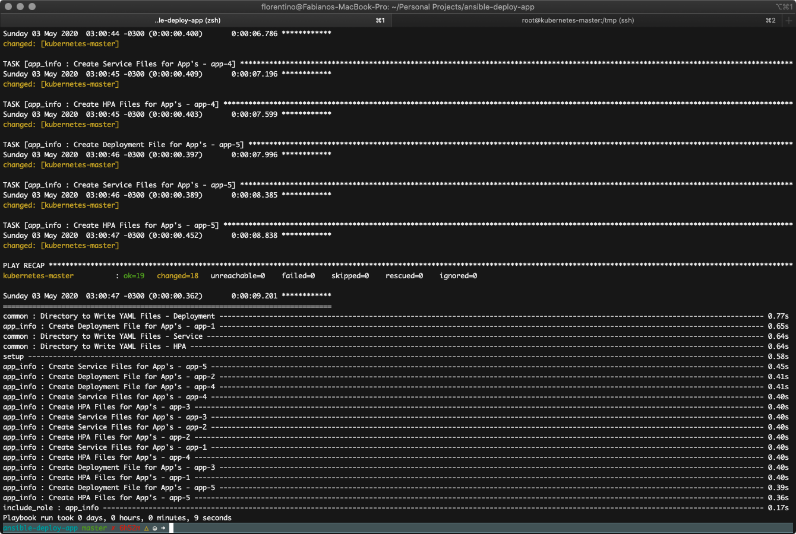
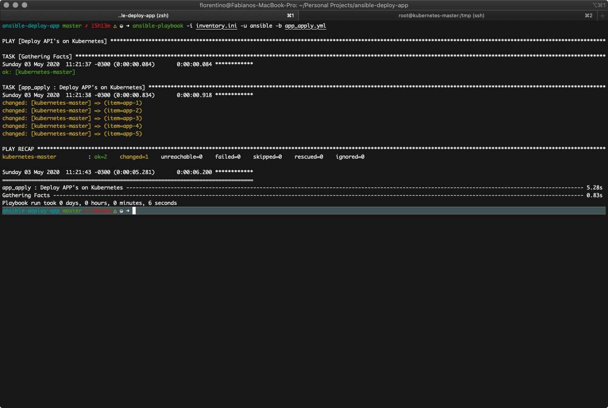
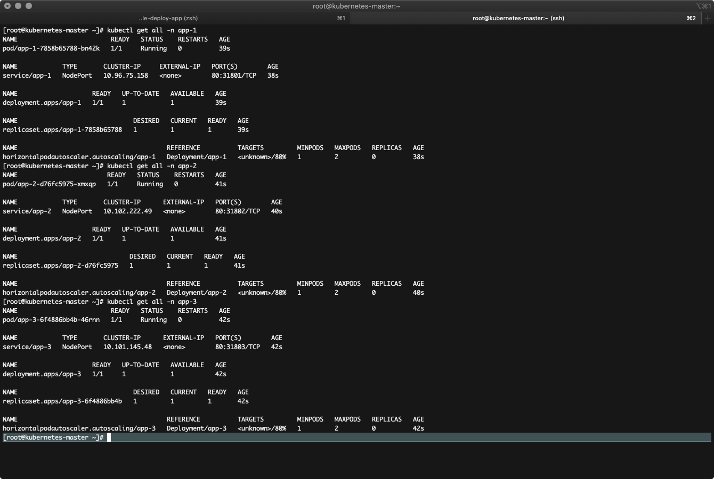
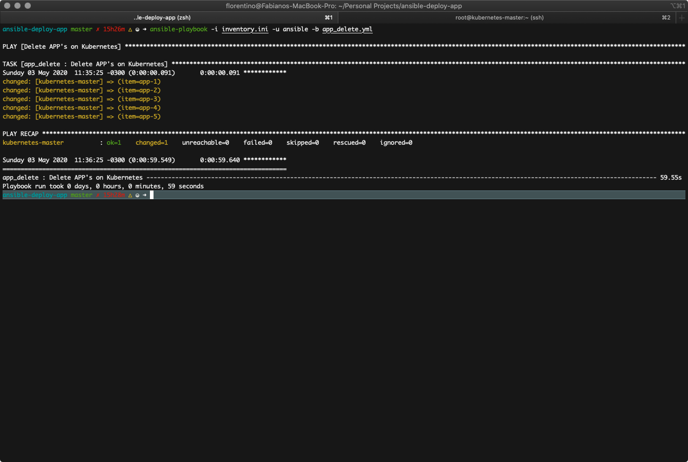
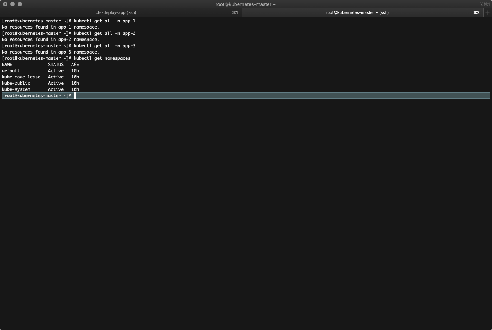

# Deploy de Aplicativos no Kubernetes com Ansible

## **Descrição**

Deploy de aplicativos usando roles ansible

### **Inventário**

Configure o inventário que criou com os servidores que farão parte do cluster kubernetes, master e workers.

```shell
vim inventory.ini
```

```shell
[all]
kubernetes-master ansible_host=192.168.7.133

[master]
kubernetes-master

```

### **Common**

Construção dos diretórios dos aplicativos para deploy no kubernetes

**Role:**

- [x] **[./roles/app_info](./roles/app_info)**
- [x] **[./roles/common](./roles/common)**

#### **Common - Tasks**

- [x] Directory to Write YAML Files - Deployment
  - Diretório para os arquivos YAML de Deployment
- [x] Directory to Write YAML Files - Service
  - Diretório para os arquivos YAML de Services
- [x] Directory to Write YAML Files - HPA
  - Diretório para os arquivos YAML de HPA

#### **Common - Variáveis**

| Variável | Descrição |
| :--- | :--- |
| app_name | Nome dos APP's que serão disponibilizados no kubernetes |

```yaml
app_name:
  - "app-1"
  - "app-2"
  - "app-3"
  - "app-4"
  - "app-5"
```

#### **APP Info - Variáveis**

Crie um arquivo YAML para cada aplicativo que será disponibilizado no cluster com as váriaveis abaixo

**Path:** **[./roles/app_info/vars](./roles/app_info/vars)**

```shell
.
└── vars
    ├── app_1.yml
    ├── app_2.yml
    ├── app_3.yml
    ├── app_4.yml
    └── app_5.yml
```

| Variável | Descrição |
| :--- | :--- |
| app_name | Nome usado para criar os recursos do aplicativo, Namespace, Deployment, Pod, Service e HPA |
| app_port | Porta do aplicativo |
| nodeport | Porta que sera aberta nos nodes do cluster |
| app_image | Imagem de container do aplicativo |
| r_cpu | Requisitos de CPU para o aplicativo |
| r_memory | Requisitos de memória para o aplicativo |
| l_cpu | Limite de uso de CPU para o aplicativo |
| l_memory | Limiete de uso de memória para o aplicativo |
| max_replicas | Número máximo de replicas |
| min_replicas | Número minímo de replicas |

```yaml
app_name: "app-1"
app_port: 80
nodeport: 31801
app_image: nginx
r_cpu: "128m"
r_memory: "32M"
l_cpu: "512m"
l_memory: "512M"
max_replicas: 2
min_replicas: 1
```

#### **Common - Uso**

Execute o playbook

```shell
ansible-playbook -i inventory.ini -u ansible -b app_create.yml
```

```yaml
---

- name: "Deploy APP's on Kubernetes"
  hosts: master
  pre_tasks:
   - setup:
      gather_subset:
       - '!all'
       - '!any'
       - 'network'
       - 'virtual'

  roles:
    - {role: common, tags: "common"}

  tasks:
  - include_role:
      role: app_info
      vars_from: "{{ item }}"
    with_items:
      - app_1.yml
      - app_2.yml
      - app_3.yml
      - app_4.yml
      - app_5.yml

```




### **Apply**

Playbook para aplicar os APP's criados com o playbook **```app_create.yml```**

#### **Apply - Tasks**

- [x] Deploy APP's on Kubernetes
  - Aplica os arquivos YAML's do APP, Deployment, Service e HPA

#### **Apply - Variáveis**

| Variável | Descrição |
| :--- | :--- |
| app_deploy | Habilita o deploy das aplicações |
| app_name | Lista de Aplicações a serem configuradas |

```yaml
app_deploy: true
app_name:
  - "app-1"
  - "app-2"
  - "app-3"
  - "app-4"
  - "app-5"
```

#### **Apply - Uso**

```shell
ansible-playbook -i inventory.ini -u ansible -b app_apply.yml
```





### **Delete**

Playbook para deletar os APP's criados com o playbook **```app_delete.yml```**

#### **Delete - Tasks**

- [x] Deploy APP's on Kubernetes
  - Deleta os APP's do kubernetes, Deployment, Service e HPA

#### **Delete - Variáveis**

| Variável | Descrição |
| :--- | :--- |
| app_deploy | Habilita o deploy das aplicações |
| app_name | Lista de Aplicações a serem configuradas |

```yaml
app_deploy: false
app_name:
  - "app-1"
  - "app-2"
  - "app-3"
  - "app-4"
  - "app-5"
```

#### **Delete - Uso**

```shell
ansible-playbook -i inventory.ini -u ansible -b app_delete.yml
```




